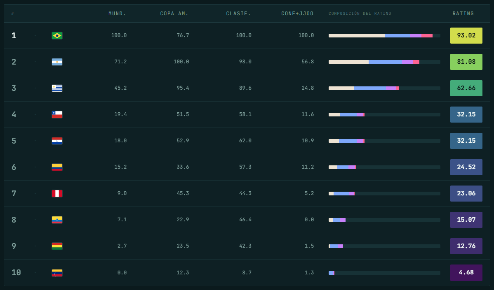

# Ranking Histórico CONMEBOL — datos

Datos crudos de resultados de las 10 asociaciones de la CONMEBOL (`ARG, BOL, BRA, CHI, COL, ECU, PAR, PER, URU, VEN`) en Mundiales, Copa América, Clasificatorias y Copa Confederaciones + Juegos Olímpicos, usados para construir el **Ranking Histórico CONMEBOL**.

📄 Metodología completa, tablero interactivo y análisis: **[datofutbol.cl/blog/ranking-conmebol](https://www.datofutbol.cl/blog/ranking-conmebol/index.html)**

> **Última actualización de datos:** Mundial 2026 (Canadá/México/USA) — julio 2026.

---

## Contenido del repositorio

| Archivo | Categoría | Filas | Rango de años |
|---|---|---:|---|
| `data_conmebol_mundiales.csv` | Mundiales | 94 | 1930–2026 |
| `data_conmebol_copa_america.csv` | Copa América (incluye ediciones como "Campeonato Sudamericano") | 378 | 1916–2024 |
| `data_conmebol_clasificatorias.csv` | Clasificatorias sudamericanas | 168 | 1953–2025 |
| `data_conmebol_confederaciones.csv` | Copa Confederaciones (incluye su antecesora, la Copa Rey Fahd) | 15 | 1992–2017 |
| `data_conmebol_jjoo.csv` | Juegos Olímpicos (fútbol masculino) | 40 | 1924–2024 |

Cada fila representa la participación de **una selección en una edición** de un torneo. `data_conmebol_copa_america.csv` y `data_conmebol_mundiales.csv` incluyen selecciones no pertenecientes a la CONMEBOL (invitadas o de otras confederaciones); para el ranking sólo se consideran las 10 asociaciones sudamericanas.

Nota: algunos archivos (`data_conmebol_mundiales.csv`, `data_conmebol_jjoo.csv`) conservan filas vacías al final, remanentes de la exportación desde Excel — no contienen datos.

## Diccionario de columnas

| Columna | Descripción |
|---|---|
| `tournament` | Nombre del torneo/edición (ej. `mundial`, `copa america`, `campeonato sud`, `clasificatorias`, `copa confederaciones`, `copa rey fahd`, `juegos olimpicos`). |
| `year` | Año de la edición. En `clasificatorias`, corresponde al año previo al Mundial respectivo (ej. el ciclo clasificatorio a Qatar 2022 se registra como 2021). |
| `n_teams` | Cantidad de selecciones participantes en esa edición (tamaño del campo). |
| `n_rounds` | Cantidad de rondas jugadas en esa edición. No aplica a `clasificatorias`. |
| `team` | Selección (código de 3 letras). |
| `pos` | Posición final en la edición. |
| `gp` | Partidos jugados. |
| `total_pts` | Puntos posibles (según partidos jugados). |
| `obtained_pts` | Puntos efectivamente obtenidos. |
| `stage` | Fase final alcanzada (ej. `campeon`, `subcampeon`, `3er lugar`, `semifinal`, `1/4 final`, `1/8 final`, `1/16 final`, `1era ronda`, `2da ronda`). No aplica a `clasificatorias`. |
| `final_stage_num` | Codificación numérica de `stage`, usada para calcular qué tan lejos llegó el equipo en el torneo. No aplica a `clasificatorias`. |

Estas columnas son el insumo crudo a partir del cual se calculan `pos_perz`, `rend_num` y `stage_per`, y luego el `score` de cada edición — el detalle completo de esas fórmulas, el bono campeón, y cómo se agregan en un rating final está documentado en el [post del blog](https://www.datofutbol.cl/blog/ranking-conmebol/index.html).

---

*Datos recopilados y mantenidos por [Dato Fútbol](https://www.datofutbol.cl) · [@DatoFutbol_cl](https://twitter.com/DatoFutbol_cl)*
